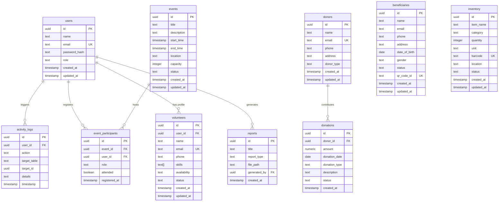

# Database Schema - Unified NGO Management System (UNMS)

This document describes the design and mapping of the PostgreSQL database schema for the UNMS system.

## Schema Overview Diagram (ER Description)

---

## Tables Description

### 1. `users`
Holds the login records, accounts, and system roles.
- `id` (UUID): Primary key, default `gen_random_uuid()`.
- `name` (TEXT): The display name.
- `email` (TEXT): Unique email address used as login ID.
- `password_hash` (TEXT): Hashed representation of the password using bcrypt.
- `role` (TEXT): System RBAC classification (`admin`, `staff`, `volunteer`).

### 2. `beneficiaries`
Profiles of people receiving welfare support or resources.
- `qr_code_id` (TEXT): Unique identifier embedded in their physical/digital ID cards.

### 3. `donors` & `donations`
Tracks the financial ledger and materials contributed to the NGO.
- `amount` (NUMERIC): Stores currency balances using precision decimal representation.
- `donor_id` (UUID): Foreign key linking the donation to the donor profile with CASCADE delete rules.

### 4. `inventory`
Warehouse stock levels of food, medicine, blankets, etc.
- `barcode` (TEXT): Unique barcode used to identify and audit stock.
- `quantity` (INTEGER): The amount currently in stock. Low stocks trigger system alerts.

### 5. `volunteers` & `events`
A detailed registry of volunteer availability, skills, and welfare program details.
- `event_participants` joins events with users (for volunteer or beneficiary registers) and records actual program attendance.
